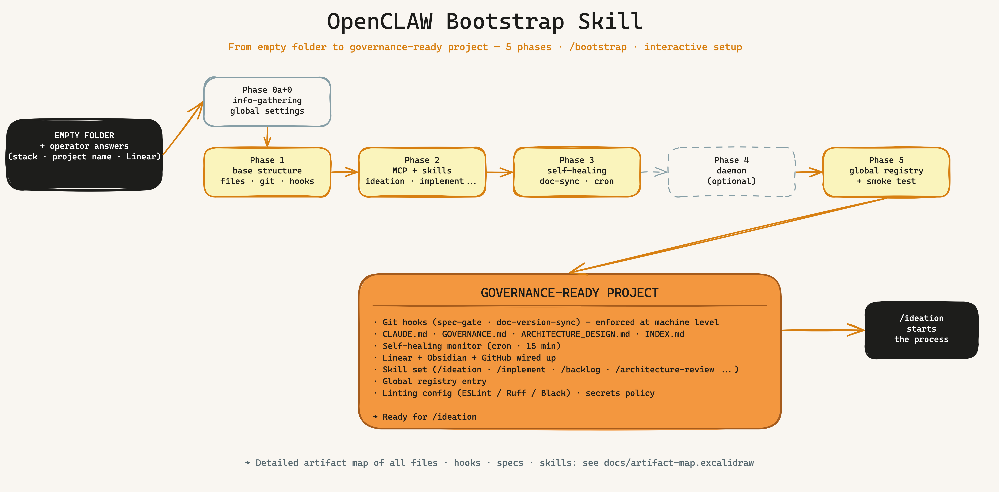

[🇬🇧 English](#english) · [🇩🇪 Deutsch](#deutsch)

---

<a name="english"></a>

# KI-Masterclass — Claude Code Skills for Serious AI Development

> A **battle-tested skill collection** for Claude Code — built in production inside an autonomous trading system, generalized for any software project.

**Core idea:** AI writes your code. Governance makes sure you still understand why in six months.

---

## What Is This?

Not prompts. Not templates. **Skills** — structured workflows that turn Claude Code into a complete development partner: with enforced traceability, machine-level governance, and a real feedback loop between idea and outcome.

Every skill in this repository solves a real problem that emerged while building a live system with 200+ files, 15+ AI agents, and real money on the line — without governance. This is what we learned.

→ **Full setup guide (German):** [HANDBUCH.md](HANDBUCH.md)

---

## System Overview



*From empty folder to governance-ready project in 5 guided phases — Git hooks, skill set, self-healing monitor and global registry entry included.*

---

## The Skills

Listed in the order you'd typically use them in a development cycle.

| Skill | Command | What it does |
|-------|---------|-------------|
| **[bootstrap](bootstrap/)** | `/bootstrap` | **Start here.** Sets up a new project in 5 phases — CLAUDE.md, Linear integration, Git hooks, full skill set. |
| **[ideation](ideation/)** | `/ideation` | Idea → 4-perspective research → Linear issue with acceptance criteria. Prevents gut-feeling decisions. |
| **[backlog](backlog/)** | `/backlog` | Sprint planning — which story now, which later, and why. Dependency-aware prioritization. |
| **[implement](implement/)** | `/implement` | 8-step protocol: Agent pattern → Spec → Code → Governance validation → Commit. |
| **[architecture-review](architecture-review/)** | `/architecture-review` | Reviews 8 architecture dimensions — risks, tech debt, improvement potential. |
| **[security-architect](security-architect/)** | `/security-architect` | STRIDE threat modeling, OWASP Top 10:2025, ASVS 5.0. Four modes: Design / Review / Audit / Skill-Scan. |
| **[research](research/)** | `/research` | 2-tier routing: Quick (WebSearch) or Deep (Perplexity sonar + cross-check). |
| **[sprint-review](sprint-review/)** | `/sprint-review` | Quarterly audit: architecture health, tech debt, backlog hygiene. |
| **[grafana](grafana/)** | `/grafana` | Grafana Cloud dashboards via MCP — panels, PromQL queries, alert rules directly from Claude Code. |
| **[cloud-system-engineer](cloud-system-engineer/)** | `/cloud-system-engineer` | VPS/Docker infrastructure: health checks, firewall, DNS, resources. Usable as a teammate in agent teams. |
| **[visualize](visualize/)** | `/visualize` | Generate architecture diagrams in Miro from existing documentation files. |
| **[skill-creator](skill-creator/)** | `/skill-creator` | Create, package and register new skills into the global registry. |
| **[design-md-generator](design-md-generator/)** | `/design-md-generator` | Extracts a website's visual design system into a machine-readable DESIGN.md (Google Stitch format) + HTML previews. |

---

## How the Skills Work Together

A typical development cycle looks like this:

```
💡 Idea
  └─ /ideation ──→ Linear issue + ACs (4 perspectives, research-backed)
       └─ /backlog ──→ Prioritization: which story goes next?
            └─ /implement ──→ Spec file → Code → Governance validation → Commit
                 └─ /architecture-review ──→ Risks? Tech debt?
                      └─ /sprint-review ──→ Quarterly audit: what worked?
```

**Governance hooks run automatically on every `git commit` and `git push`:**
- `spec-gate.sh` — blocks commits without a linked spec file
- `doc-version-sync.sh` — blocks pushes when documentation is out of sync

No spec, no commit. That's the difference between a prompt and a governance framework.

---

## Where to Start

| Situation | Recommendation |
|-----------|---------------|
| New project, empty folder | → [/bootstrap](bootstrap/) — start here |
| Existing project, needs structure | → [HANDBUCH.md §4](HANDBUCH.md) — step-by-step retrofit |
| Just one specific skill | → Clone the desired skill folder and install it |
| Want to understand everything first | → [HANDBUCH.md](HANDBUCH.md) — full reference |

---

## Prerequisites

- **Claude Code** (CLI or IDE extension)
- **Linear** account + API key (issue tracking)
- **GitHub** repository for your project
- Optional extensions: Grafana Cloud, Miro, Hostinger VPS — skills use what's available

---

*Born from the [OpenCLAW Trading System](https://github.com/vibercoder79/openclaw_trading) — an autonomous crypto trading bot with 15+ AI agents, 34 self-healing checks, and $200k+ demo capital in production.*

---

<a name="deutsch"></a>

# KI-Masterclass — Claude Code Skills für ernsthafte KI-Entwicklung

> Eine **battle-tested Skill-Sammlung** für Claude Code — entstanden im Produktivbetrieb eines autonomen Trading-Systems, generalisiert für jedes Software-Projekt.

**Kernidee:** KI schreibt deinen Code. Governance stellt sicher, dass du in 6 Monaten noch weißt warum.

---

## Was ist das hier?

Keine Prompts. Keine Templates. **Skills** — strukturierte Workflows die Claude Code zu einem vollständigen Entwicklungspartner machen: mit erzwungener Traceability, maschineller Governance und einem echten Feedback-Loop zwischen Idee und Ergebnis.

Jeder Skill in diesem Repository löst ein echtes Problem das entstanden ist, als ein reales System mit 200+ Dateien, 15+ KI-Agents und Echtgeld-Einsatz ohne Governance gebaut wurde. Das hier ist die Lehre daraus.

→ **Komplettes Handbuch mit Schritt-für-Schritt-Setup:** [HANDBUCH.md](HANDBUCH.md)

---

## Das System im Überblick


*Vom leeren Ordner zum governance-ready Projekt in 5 geführten Phasen — Governance-Hooks, Skill-Set, Self-Healing-Monitor und globaler Registry-Eintrag inklusive.*

---

## Die Skills

In der Reihenfolge des typischen Einsatzes im Entwicklungs-Workflow.

| Skill | Befehl | Was er tut |
|-------|--------|------------|
| **[bootstrap](bootstrap/)** | `/bootstrap` | **Einstieg:** Neues Projekt in 5 Phasen aufsetzen — CLAUDE.md, Linear, Git-Hooks, Skill-Set. |
| **[ideation](ideation/)** | `/ideation` | Idee → 4-Perspektiven-Research → Linear Issue mit ACs. Verhindert Bauchgefühl-Entscheidungen. |
| **[backlog](backlog/)** | `/backlog` | Sprint Planning — welche Story jetzt, welche nach hinten, warum? Abhängigkeiten-aware. |
| **[implement](implement/)** | `/implement` | 8-Schritte-Protokoll: Agent-Pattern → Spec → Code → Governance-Validation → Commit. |
| **[architecture-review](architecture-review/)** | `/architecture-review` | Prüft 8 Architektur-Dimensionen — Risiken, Tech Debt, Verbesserungspotential. |
| **[security-architect](security-architect/)** | `/security-architect` | STRIDE Threat Modeling, OWASP Top 10:2025, ASVS 5.0 — 4 Modi (Design/Review/Audit/Skill-Scan). |
| **[research](research/)** | `/research` | 2-Tier-Routing: Quick (WebSearch) oder Deep (Perplexity sonar + Gegencheck). |
| **[sprint-review](sprint-review/)** | `/sprint-review` | Quartals-Audit: Architektur-Gesundheit, Tech Debt, Backlog-Hygiene. |
| **[grafana](grafana/)** | `/grafana` | Grafana Cloud Dashboards via MCP — Panels, PromQL, Alert Rules direkt aus Claude Code. |
| **[cloud-system-engineer](cloud-system-engineer/)** | `/cloud-system-engineer` | VPS/Docker-Infrastruktur: Health-Check, Firewall, DNS, Ressourcen. Als Teammate in Agent-Teams einsetzbar. |
| **[visualize](visualize/)** | `/visualize` | Architektur-Diagramme in Miro aus bestehenden Doku-Dateien generieren. |
| **[skill-creator](skill-creator/)** | `/skill-creator` | Neue Skills erstellen, paketieren und in die globale Registry einbinden. |
| **[design-md-generator](design-md-generator/)** | `/design-md-generator` | Extrahiert das visuelle Design-System einer Website als maschinenlesbare DESIGN.md (Google-Stitch-Format) + HTML-Previews. |

---

## Wie die Skills zusammenspielen

```
💡 Idee
  └─ /ideation ──→ Linear Issue + ACs (4 Perspektiven, Research-backed)
       └─ /backlog ──→ Priorisierung: welche Story jetzt?
            └─ /implement ──→ Spec-File → Code → Governance-Validation → Commit
                 └─ /architecture-review ──→ Risiken? Tech Debt?
                      └─ /sprint-review ──→ Quartals-Audit: Was hat funktioniert?
```

**Governance-Hooks laufen automatisch bei jedem `git commit` und `git push`:**
- `spec-gate.sh` — blockiert Commits ohne verknüpftes Spec-File
- `doc-version-sync.sh` — blockiert Pushes wenn Doku-Dateien veraltet sind

---

## Wo anfangen?

| Situation | Empfehlung |
|-----------|------------|
| Neues Projekt, leerer Ordner | → [/bootstrap](bootstrap/) |
| Bestehendes Projekt, Chaos | → [HANDBUCH.md §4](HANDBUCH.md) |
| Nur einzelne Skills | → Gewünschten Skill-Ordner klonen und installieren |
| Alles verstehen bevor ich anfange | → [HANDBUCH.md](HANDBUCH.md) |

---

*Entstanden aus dem [OpenCLAW Trading System](https://github.com/vibercoder79/openclaw_trading) — einem autonomen Krypto-Trading-Bot mit 15+ KI-Agents, 34 Self-Healing-Checks und 200k+ Demo-Kapital im Produktivbetrieb.*
