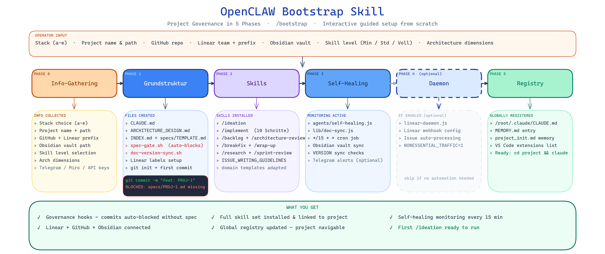

# KI-Masterclass — Claude Code Skills für ernsthafte KI-Entwicklung

> Eine **battle-tested Skill-Sammlung** für Claude Code — entstanden im Produktivbetrieb eines autonomen Trading-Systems, generalisiert für jedes Software-Projekt.

**Kernidee:** KI schreibt deinen Code. Governance stellt sicher, dass du in 6 Monaten noch weißt warum.

---

## Was ist das hier?

Keine Prompts. Keine Templates. **Skills** — strukturierte Workflows die Claude Code zu einem vollständigen Entwicklungspartner machen: mit erzwungener Traceability, maschineller Governance und einem echten Feedback-Loop zwischen Idee und Ergebnis.

Jeder Skill in diesem Repository löst ein echtes Problem das entstanden ist, als ein reales System mit 200+ Dateien, 15+ KI-Agents und Echtgeld-Einsatz ohne Governance gebaut wurde. Das hier ist die Lehre daraus.

→ **Komplettes Handbuch mit Schritt-für-Schritt-Setup:** [HANDBUCH.md](HANDBUCH.md)

---

## Das System im Überblick



*Vom leeren Ordner zum governance-ready Projekt in 5 geführten Phasen — Governance-Hooks, Skill-Set, Self-Healing-Monitor und globaler Registry-Eintrag inklusive.*

---

## Die Skills

Skills sind in der Reihenfolge ihres typischen Einsatzes im Entwicklungs-Workflow gelistet.

| Skill | Slash-Befehl | Was er tut |
|-------|-------------|------------|
| **[bootstrap](bootstrap/)** | `/bootstrap` | **Einstieg:** Neues Projekt in 5 Phasen aufsetzen — CLAUDE.md, Linear, Git-Hooks, Skill-Set. Hier starten. |
| **[ideation](ideation/)** | `/ideation` | Idee → 4-Perspektiven-Research → Linear Issue mit ACs. Verhindert Bauchgefühl-Entscheidungen. |
| **[backlog](backlog/)** | `/backlog` | Sprint Planning — welche Story jetzt, welche nach hinten, warum? Abhängigkeiten-aware. |
| **[implement](implement/)** | `/implement` | 8-Schritte-Protokoll: Agent-Pattern → Spec → Code → Governance-Validation → Commit. |
| **[architecture-review](architecture-review/)** | `/architecture-review` | Prüft 8 Architektur-Dimensionen — Risiken, Tech Debt, Verbesserungspotential. |
| **[security-architect](security-architect/)** | `/security-architect` | STRIDE Threat Modeling, OWASP Top 10:2025, ASVS 5.0 — 4 Modi (Design/Review/Audit/Skill-Scan). |
| **[research](research/)** | `/research` | 2-Tier-Routing: Quick (WebSearch) oder Deep (Perplexity sonar + Gegencheck). |
| **[sprint-review](sprint-review/)** | `/sprint-review` | Quartals-Audit: Architektur-Gesundheit, Tech Debt, Backlog-Hygiene. |
| **[grafana](grafana/)** | `/grafana` | Grafana Cloud Dashboards via MCP — Panels, PromQL, Alert Rules direkt aus Claude Code. |
| **[cloud-system-engineer](cloud-system-engineer/)** | `/cloud-system-engineer` | VPS/Docker-Infrastruktur: Health-Check, Firewall, DNS, Ressourcen. Als Teammate in Agent-Teams einsetzbar. |
| **[visualize](visualize/)** | `/visualize` | Architektur-Diagramme in Miro aus bestehenden Doku-Dateien generieren. |
| **[skill-creator](skill-creator/)** | `/skill-creator` | Neue Skills erstellen, paketieren und in die globale Registry einbinden. |

---

## Wie die Skills zusammenspielen

Ein typischer Entwicklungs-Zyklus sieht so aus:

```
💡 Idee
  └─ /ideation ──→ Linear Issue + ACs (4 Perspektiven, Research-backed)
       └─ /backlog ──→ Priorisierung: welche Story jetzt?
            └─ /implement ──→ Spec-File → Code → Governance-Validation → Commit
                 └─ /architecture-review ──→ Risiken? Tech Debt?
                      └─ /sprint-review ──→ Quartals-Audit: Was hat funktioniert?
```

**Governance-Hooks laufen automatisch bei jedem `git commit` und `git push`:**
- `spec-gate.sh` — blockiert Commits ohne verknüpftes Spec-File
- `doc-version-sync.sh` — blockiert Pushes wenn Doku-Dateien veraltet sind

Kein Skill im Team? Kein Commit. Das ist der Unterschied zwischen einem Prompt und einem Governance-Framework.

---

## Wo anfangen?

| Situation | Empfehlung |
|-----------|------------|
| Neues Projekt, leerer Ordner | → [/bootstrap](bootstrap/) — das ist der Einstieg |
| Bestehendes Projekt, Chaos | → [HANDBUCH.md §4](HANDBUCH.md) — Schritt-für-Schritt Nachinstallation |
| Nur einzelne Skills | → Direkt den gewünschten Skill-Ordner klonen und installieren |
| Alles verstehen bevor ich anfange | → [HANDBUCH.md](HANDBUCH.md) — vollständige Referenz |

---

## Voraussetzungen

- **Claude Code** (CLI oder IDE-Extension)
- **Linear** Account + API Key (Issue Tracking)
- **GitHub** Repo für dein Projekt
- Optionale Erweiterungen: Grafana Cloud, Miro, Hostinger VPS — Skills greifen auf was vorhanden ist

---

*Entstanden aus dem [OpenCLAW Trading System](https://github.com/vibercoder79/openclaw_trading) — einem autonomen Krypto-Trading-Bot mit 15+ KI-Agents, 34 Self-Healing-Checks und 200k+ Demo-Kapital im Produktivbetrieb.*
